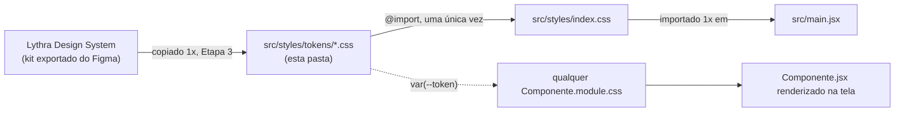

# Tokens de Design do Lythra — organização e teoria

Este documento explica **o que é** esta pasta, **por que** ela existe organizada do jeito que está, e
como cada arquivo se conecta com o resto do projeto. É material de apoio didático — se você está
estudando front-end através do Lythra, este é o lugar certo para entender a teoria por trás de "tokens
de design" antes de ler o código em si (os arquivos `.css` desta pasta também têm comentários extensos,
arquivo por arquivo — este README dá a visão de conjunto).

## 1. O que é um "design token"

Um **design token** é um valor de design (uma cor, um tamanho de fonte, um espaçamento...) com um
**nome**, guardado num lugar central, para nunca mais ser escrito "cru" dentro de um componente.

Sem tokens, cada componente decide sozinho como desenhar as coisas:

```css
/* Button.module.css */
.button { background: #ef8c6f; border-radius: 24px; }

/* Card.module.css */
.card { border-radius: 22px; } /* alguém digitou 22 em vez de 24 — ninguém percebe */
```

Com tokens, todo componente lê do mesmo lugar:

```css
/* tokens/colors.css */
:root { --primary: #ef8c6f; }

/* Button.module.css */
.button { background: var(--primary); border-radius: var(--radius-clay-md); }

/* Card.module.css */
.card { border-radius: var(--radius-clay-md); } /* mesmo valor, garantido */
```

Isso resolve dois problemas reais de qualquer produto que cresce:

1. **Consistência** — é fisicamente impossível dois componentes usarem tons de coral "quase iguais mas
   não exatamente" quando os dois leem a mesma variável.
2. **Manutenção** — se a cor de marca mudar amanhã, muda em **um lugar** (`tokens/colors.css`), e todo
   o produto atualiza sozinho. Ninguém precisa caçar `#ef8c6f` espalhado em dezenas de arquivos.

A técnica não é exclusiva do Lythra — é como praticamente todo design system profissional (Material
Design do Google, os design systems de Airbnb, Shopify, GitHub...) organiza suas decisões visuais.

## 2. Por que 6 arquivos, cada um com um assunto só

```
tokens/
├── colors.css        cor de marca, cor neutra, contraste
├── typography.css     fonte, tamanho, peso, altura de linha
├── spacing.css        espaçamento entre elementos, largura de container
├── effects.css         raio, sombra, animação, + reset global
├── breakpoints.css     pontos de quebra responsiva
└── scrollbar.css       barra de rolagem customizada
```

Cada arquivo cobre **uma categoria de decisão visual**, nunca duas. Isso é **separação de
responsabilidades** aplicada a CSS: se você precisa mexer na paleta de cores do produto, você sabe, sem
precisar procurar, que o arquivo certo é `colors.css` — não corre o risco de esbarrar em uma regra de
espaçamento no meio do caminho. A mesma divisão (cor / tipografia / espaço / efeito) é como o
`Lythra Design System` (o kit de referência visual, exportado do Figma) já organiza os tokens — os
quatro primeiros arquivos desta pasta são cópias fiéis de `lythra/Lythra Design System/tokens/*.css`
(com uma correção de contraste documentada em `colors.css`); `breakpoints.css` e `scrollbar.css` **não
vêm do kit** — são extensões que este projeto precisou e o kit não define, mantidas no mesmo padrão de
organização.

## 3. Duas camadas de token: primitivo e semântico

Repare que boa parte dos arquivos desta pasta declara tokens em **duas camadas diferentes**:

| Camada | Responde à pergunta | Exemplo |
|---|---|---|
| **Primitivo** | "Qual é o valor?" | `--primary: #ef8c6f;` |
| **Semântico** | "Para que serve?" | `--text-link: var(--primary-pressed);` |

Um token semântico nunca inventa um valor novo — ele **aponta** para um primitivo, dando um nome de
**intenção de uso**. Por que essa indireção extra, em vez de todo componente usar o primitivo direto?

Porque um componente não deveria precisar saber *qual* cor primitiva está "certa" para ele hoje — ele só
quer expressar sua intenção ("esta é a cor de um link", "este é o fundo de um card"). Se amanhã a
decisão de qual primitivo representa "fundo de card" mudar, só o alias muda — nenhum dos componentes que
já usam `var(--surface-card)` precisa ser tocado. É a mesma ideia por trás de qualquer camada de
abstração em programação: uma função `calcularFrete()` é mais fácil de manter do que a fórmula copiada
em cada lugar que precisa dela.

## 4. A convenção "cor" + "on-cor"

Toda cor pensada como **fundo** (`--primary`, `--secondary`, `--danger`...) tem uma variável irmã
`--on-<cor>` — a cor de **texto/ícone** que deve ser usada por cima daquele fundo. Essa convenção vem do
Material Design e existe para resolver um problema real de acessibilidade: sem ela, é fácil colocar
texto branco sobre um fundo claro "porque parecia bonito" e só descobrir depois que ninguém consegue ler
direito. Com o par obrigatório, a pergunta "que cor de texto uso aqui?" já vem respondida junto com a
cor de fundo.

Essa convenção é também a origem da correção mais importante feita neste projeto: o kit de design
original definia `on-primary`/`on-secondary`/`on-danger` como branco — mas branco sobre essas cores
(que são claras/pastéis, não escuras) **falha o contraste mínimo de acessibilidade (WCAG AA, 4.5:1)**.
Os três pares foram recalculados e corrigidos para usar `on-surface` (marrom escuro) no lugar de branco.
Os números completos do cálculo estão documentados no topo de `colors.css`.

## 5. Como os tokens chegam até um componente (o fluxo completo)



Duas regras fecham esse fluxo e **nunca** têm exceção no projeto:

- Os arquivos desta pasta são importados **uma única vez**, em `styles/index.css` — nenhum
  `Componente.module.css` importa um arquivo de `tokens/` diretamente.
- Todo componente consome um token via `var(--nome-do-token)` — nenhum `.module.css` do projeto escreve
  um valor de cor, raio, sombra ou tamanho de fonte "cru" (hexadecimal, `px` solto...) por fora dessa
  pasta. Se um valor novo for necessário, ele nasce aqui, com nome, não dentro do componente que
  precisou dele primeiro.

## 6. Resumo por arquivo

| Arquivo | Define | Origem |
|---|---|---|
| `colors.css` | Paleta de marca, neutros, pares cor/on-cor, aliases semânticos | Kit, com correção de contraste WCAG documentada |
| `typography.css` | Fontes (Fredoka/Nunito, autohospedadas), escala de tamanho, peso, altura de linha | Kit, com troca de CDN por `@fontsource` |
| `spacing.css` | Escala de espaçamento (grade de 4px) e larguras máximas de conteúdo | Kit, sem alteração |
| `effects.css` | Raio, sombra "clay" (dupla, efeito neumorfismo), curvas de animação, **+ reset global** (`box-sizing`, `body`, `a`) | Kit, sem alteração nos tokens |
| `breakpoints.css` | Os 2 pontos de quebra responsiva (tablet/desktop) | Criado pelo projeto — o kit não define breakpoint |
| `scrollbar.css` | Barra de rolagem customizada (Firefox + WebKit) | Criado pelo projeto — o kit não define isso |

## 7. Regras de ouro desta pasta

1. **Nunca hardcode um valor visual fora daqui.** Se você está escrevendo `#ef8c6f`, `24px` de raio, ou
   qualquer cor/espaço/sombra direto num `.module.css`, pare — o valor certo já existe como token, ou
   precisa nascer aqui antes de ser usado.
2. **Semântico antes de primitivo, quando existir um.** Prefira `var(--surface-card)` a `var(--surface)`
   dentro de um componente, sempre que um alias semântico já cobrir a intenção — só use o primitivo
   direto quando não houver um nome semântico melhor ainda.
3. **Toda cor de fundo nova vem com seu par `on-<cor>` — e o contraste dos dois é calculado, não
   estimado a olho.** Ver a metodologia (fórmula de luminância relativa do WCAG) documentada em
   `colors.css`.
4. **Esta pasta não conhece nenhum componente.** Nenhum arquivo aqui referencia `Button`, `Card` ou
   qualquer nome de componente — tokens descrevem *decisões de design*, não *onde são usados*. Quem
   depende de quem é sempre numa direção só: componente → token, nunca o contrário.
